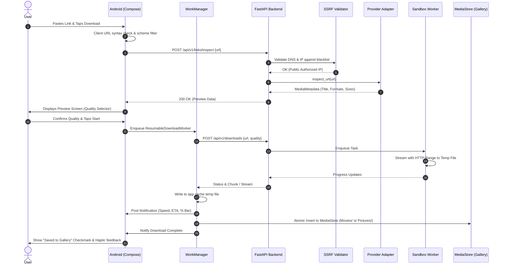

# OP Downloader - System & UI Architecture

## 1. Executive Overview

**OP Downloader** is a high-performance, security-hardened Android application and companion backend service designed to download and save authorized, user-owned, or explicitly permissible media directly to device storage via Android's MediaStore API.

### Strict Legal & Security Guardrails
* **No DRM Circumvention:** The system rejects any request targeting DRM-protected streams (Widevine, FairPlay, PlayReady).
* **No Authentication / Access-Control Bypass:** The system does not support bypassing login walls, paywalls, private account locks, or CAPTCHA.
* **Authorized Sources Only:** Downloads are restricted to direct media URLs, verified user-owned content, or platforms with explicit public download APIs/licenses conforming to terms of service.
* **Defense-in-Depth:** Every URL, filename, and binary stream is treated as untrusted and validated against strict multi-tier security gates.

---

## 2. High-Level System Architecture

```mermaid
graph TB
    subgraph "Android Client (Kotlin + Jetpack Compose)"
        UI[Compose UI: Home / Downloads / Settings]
        VM[ViewModels + StateFlow]
        REPO[Repository Layer]
        WM[WorkManager Worker]
        ROOM[(Local Room DB)]
        KS[Android Keystore]
        MS[Android MediaStore<br/>Pictures/ & Movies/]
    end

    subgraph "Network & Edge Security"
        TLS[HTTPS / TLS 1.3 Strict]
        NGINX[Reverse Proxy / Nginx / Rate Limiting]
    end

    subgraph "Backend Core (FastAPI / Python)"
        API[FastAPI Gateway]
        AUTH[Auth & JWT Service]
        URLVAL[SSRF & URL Validation Engine]
        ROUTER[Provider Adapter Router]
        AUDIT[Structured Audit Logger]
    end

    subgraph "Data & Queue Infrastructure"
        PG[(PostgreSQL 16)]
        REDIS[(Redis 7 - State & Rate Limit)]
        CELERY[Celery / RQ Worker Queue]
    end

    subgraph "Worker Isolation Sandbox"
        WORKER[Isolated Worker Container<br/>(Non-root, Read-only FS, Resource-capped)]
        TEMP[(Temporary Scratch Storage<br/>1-hr TTL, Non-executable)]
    end

    subgraph "Target External Sources"
        SRC_DIRECT[Authorized Direct Media URL]
        SRC_AUTH[Permitted Public API Provider]
    end

    %% Client internal flow
    UI --> VM
    VM --> REPO
    REPO --> ROOM
    REPO --> WM
    WM --> MS
    REPO --> KS

    %% Client to Edge
    REPO -->|HTTPS REST API| TLS
    TLS --> NGINX
    NGINX --> API

    %% API internals
    API --> AUTH
    API --> URLVAL
    API --> ROUTER
    API --> AUDIT
    API --> PG
    API --> REDIS
    API --> CELERY

    %% Worker Execution
    CELERY --> WORKER
    WORKER --> URLVAL
    WORKER --> TEMP
    WORKER -->|Stream / Chunks| SRC_DIRECT
    WORKER -->|Stream / Chunks| SRC_AUTH
```

---

## 3. Component Details

### 3.1 Android Client Layer
* **UI Layer:** 100% Jetpack Compose using Material 3 with a dark-first luxury aesthetic (`#0B0D10` base, `#15181D` card surface). Clean state-driven architecture with uniflow events.
* **Domain & ViewModel Layer:** Exposes immutable `StateFlow` to Compose. Handles user input sanitization, clipboard inspection (read on user interaction only, zero background polling), and download state transitions.
* **Data Layer:** Offline-first caching via **Room Database** for download history and queue items. Secure token storage via **Android Keystore** and `EncryptedSharedPreferences`.
* **Download Engine (Android Native):** **WorkManager** orchestrates foreground/background download tasks with exponential retry backoff, HTTP Range chunking, and direct piping to temporary app cache before committing to **MediaStore** (`Movies/OP Downloader` or `Pictures/OP Downloader`).

### 3.2 Backend Service Layer
* **API Gateway (FastAPI):** Asynchronous endpoints enforcing strict Pydantic schemas, JWT authentication, and device-level and IP-level rate limiting.
* **SSRF & URL Validation Engine:** Resolves DNS before connection, checks against CIDR blacklists (RFC 1918, RFC 3927, loopback, link-local, cloud metadata `169.254.169.254`), validates schemes (HTTPS only), pinches redirects, and detects DNS rebinding.
* **Provider Adapter Framework:** Pluggable provider architecture. Each provider adheres to `BaseMediaProvider`:
  - `can_handle(url: str) -> bool`
  - `inspect_url(url: str) -> MediaMetadata`
  - `resolve_stream(url: str, quality: str) -> StreamDescriptor`
  - `validate_authorization(url: str) -> bool`
* **Isolated Worker Sandbox:** Dedicated Docker container running under an unprivileged `nobody` / `appuser` uid, with drop-all Linux capabilities, non-executable scratch filesystem (`noexec, nosuid`), strict RAM limits (512MB), CPU limits (1.0), and 60-minute automated storage garbage collection.

---

## 4. UI Architecture & Design System

### 4.1 Visual Design Tokens
| Token | Hex Value | Usage |
| :--- | :--- | :--- |
| `BackgroundPrimary` | `#0B0D10` | App background, navigation scaffold |
| `SurfaceCard` | `#15181D` | Input cards, download item containers, sheets |
| `SurfaceElevated` | `#1E2229` | Modals, dropdowns, floating action elements |
| `TextPrimary` | `#FFFFFF` | Headlines, titles, active badges |
| `TextSecondary` | `#9CA3AF` | Subtitles, file metadata, captions |
| `TextTertiary` | `#6B7280` | Placeholders, inactive navigation icons |
| `AccentPrimary` | `#6366F1` | Brand Indigo: primary CTA buttons, active tabs |
| `AccentGradient` | `linear-gradient(#6366F1, #8B5CF6)` | Logo monogram, highlight borders |
| `StatusSuccess` | `#22C55E` | Download complete, saved to Gallery badge |
| `StatusError` | `#EF4444` | Invalid URL, failed download, network error |
| `StatusWarning` | `#F59E0B` | Retrying, pausing, quota warnings |

### 4.2 Typography Hierarchy (Inter / Roboto System)
* **Large Heading:** 28sp / Bold (`FontWeight.W700`) - Screen titles, Splash branding
* **Section Heading:** 20sp / SemiBold (`FontWeight.W600`) - Card headings, "Recent Downloads"
* **Body Large:** 16sp / Normal (`FontWeight.W400`) - URL input field, Preview item titles
* **Body Secondary:** 14sp / Medium (`FontWeight.W500`) - Quality selector chips, button text
* **Caption / Meta:** 12sp / Normal (`FontWeight.W400`) - File sizes, speeds, timestamps

### 4.3 Navigation Architecture
A minimalist bottom bar with 3 primary destinations:
1. **Home (`/home`):**
   - Brand Header (`OP Downloader` + Quick Settings icon).
   - "Save your media" Hero statement.
   - Interactive Smart Input Card (Clipboard paste button, clear button, URL validator state badge).
   - Primary `DOWNLOAD` CTA button with loading micro-animation.
   - Provider Capabilities disclaimer ("Only user-authorized & public media").
   - Recent Downloads carousel / compact cards.
2. **Downloads (`/downloads`):**
   - Filter Tabs: `All`, `Videos`, `Photos`.
   - Active queue items (live progress bar, speed KB/s or MB/s, ETA, Pause / Cancel buttons).
   - Completed history list with thumbnail, metadata, and single-tap `Open in Gallery` or `Share`.
   - Empty state illustration and quick link to Home.
3. **Settings (`/settings`):**
   - **Download:** Default quality (Original, 1080p, 720p, Ask every time), Wi-Fi only toggle, Max concurrent downloads (1, 2, 3), Auto-retry toggle.
   - **Appearance:** Theme (System, Dark, Light), Micro-animations toggle.
   - **Security:** Biometric/App lock, Privacy mode, Clear temporary cache.
   - **About:** Version, Open-Source Licenses, Terms of Service & Privacy Policy.

---

## 5. End-to-End Download Workflow


