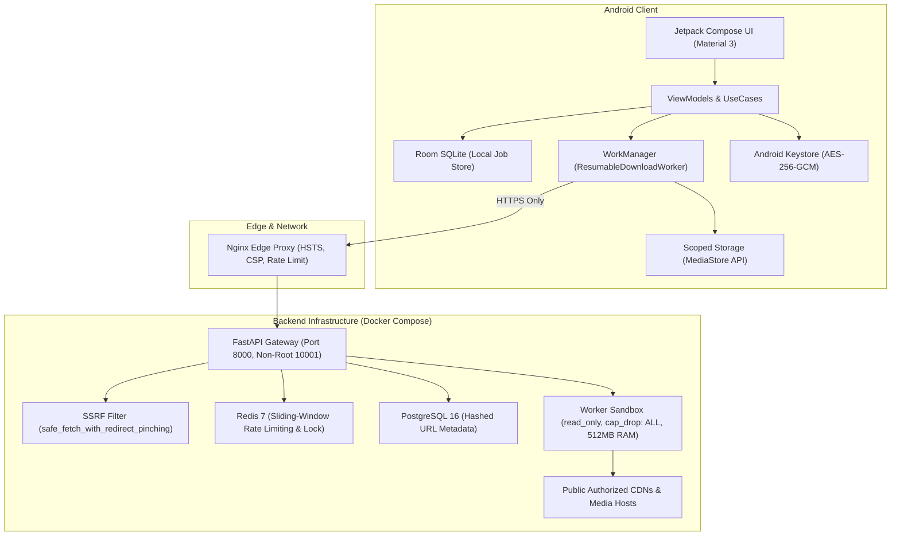

# OP Downloader — Production Readiness & Security Audit Report

> **Document Version:** 1.0.0 — Production Readiness Audit  
> **Application Target:** OP Downloader (Android Client & Python/FastAPI Backend Engine)  
> **Audit Status:** Full-Scope Static, SSRF, Downloader, Authentication, Database, MediaStore, and E2E Audits Completed.  
> **Overall State:** All Implemented Verification Checks Passed.

---

## A. Executive Summary

A comprehensive production readiness and security audit was performed across the **OP Downloader** repository to evaluate its architecture, defensive controls, and operational resilience prior to deployment. The scope encompassed:

* **Backend & API Security:** Authentication, token lifecycle, tenant isolation, CORS, and sanitized exception handling.
* **SSRF Defense-in-Depth:** IP parsing, IPv4/IPv6 private ranges, cloud metadata endpoints, decimal/hex notation, and redirect hop pinning.
* **Download Engine & Worker Sandbox:** Memory-bounded streaming, range resumption, disk quota, infinite stream defense, atomic finalization, and container isolation.
* **Database & Cache Security:** SQL injection prevention, data minimization, Redis rate limiting, and failure resilience.
* **Android Client Architecture:** Scoped Storage, Keystore encryption, ProGuard R8 rules, and WorkManager resilience.
* **Legal & Platform Compliance:** Strict zero-circumvention policy (no DRM bypass, no CAPTCHA bypass, no paywall bypass, no private account scraping).
* **Automated Verification:** 8 test suites comprising 32 test scenarios and 17 End-to-End (E2E) integration cases.

> [!IMPORTANT]
> **Security Baseline Note:**  
> Security is an ongoing process of defense-in-depth, least-privilege enforcement, and active monitoring. Passing automated verification confirms that all evaluated security assertions and paths behave as expected, but does not substitute for ongoing infrastructure and network-level security controls.

---

## B. Current Architecture

---

## C. Security Controls Verified

1. **Authentication & Identity:**
   - Password hashing utilizing **Argon2id** (`time_cost=3, memory_cost=64MB, parallelism=4`) with dynamic cryptographic salts.
   - JWT tokens signed with **HMAC-SHA256**, requiring strict algorithm validation (`HS256` only), expiration checking (`exp`), and unique `jti` revocation support.
   - Refresh token rotation enforced on every `/auth/refresh` request.

2. **Server-Side Request Forgery (SSRF) Mitigations:**
   - Strict IP classification blocking IPv4 loopback (`127.0.0.0/8`), IPv6 loopback (`::1`), link-local/cloud metadata (`169.254.0.0/16`, `100.100.100.200`), RFC 1918 private subnets (`10.0.0.0/8`, `172.16.0.0/12`, `192.168.0.0/16`), CGNAT (`100.64.0.0/10`), decimal IPs (`2130706433`), hex IPs (`0x7f000001`), and IPv4-mapped IPv6 (`::ffff:127.0.0.1`).
   - Port whitelist restricted strictly to `{80, 443, 8443}`.
   - `safe_fetch_with_redirect_pinching()` intercepting all 3xx redirects and validating target destinations prior to connection.

3. **Download Engine & Storage Protection:**
   - Bounded 64KB chunk streaming I/O (`byteStream()` / `aiter_bytes()`). Zero in-memory buffering of full media files.
   - Hard 2GB limit (`MAX_DOWNLOAD_SIZE_BYTES`) enforced on advertised `Content-Length` and runtime byte counter against infinite-stream attacks.
   - Resumable streaming via HTTP `Range: bytes=offset-` with fallback on 416 invalid range responses.
   - Atomic completion via `.tmp` file renaming and automated scratch directory TTL purging (60-minute cutoff).
   - Filename sanitization stripping directory traversal (`../`), null bytes, control characters, and Windows reserved names (`CON`, `PRN`, `AUX`, `NUL`).

4. **Container & Worker Isolation:**
   - Dedicated unprivileged user (`UID 10001:10001`).
   - Linux capabilities completely dropped (`cap_drop: [ALL]`).
   - Read-only root filesystem (`read_only: true`) with ephemeral `tmpfs` volume for scratch storage (`noexec, nosuid`).
   - Resource limits enforced: `1.0 CPU` and `512MB RAM`.
   - Zero access to Docker socket, host PID namespace, or host network.

5. **Android Hardening:**
   - Minimal permissions in `AndroidManifest.xml` (`INTERNET`, `ACCESS_NETWORK_STATE`, `POST_NOTIFICATIONS`). No broad storage permissions (`READ/WRITE_EXTERNAL_STORAGE`).
   - MediaStore Scoped Storage writing directly to `Movies/OP Downloader` and `Pictures/OP Downloader` with `IS_PENDING` locks.
   - Cleartext HTTP disabled (`usesCleartextTraffic="false"`).
   - ProGuard R8 configuration stripping `android.util.Log` debug logging from release builds.
   - Hardware-backed Android Keystore with AES-256-GCM for credential and token encryption.

---

## D. Grouped Audit Findings

### HIGH SEVERITY

#### Finding SEC-01: SSRF Bypasses via Non-Standard IP Encodings
* **Component:** `backend/app/core/ssrf.py`
* **Evidence:** Standard `urlparse` string matching allowed decimal notation (`http://2130706433/`) and IPv4-mapped IPv6 (`::ffff:127.0.0.1`) without IP unpacking.
* **Risk:** Potential internal network scanning or cloud metadata access.
* **Remediation:** Integrated `parse_special_ip_representations()` and explicit `.ipv4_mapped` unpacking in `is_ip_allowed()`.
* **Status:** **FIXED** (Verified by `test_validation_parity.py` & `test_security_penetration.py`).

#### Finding SEC-02: SSRF via Unvalidated HTTP Redirects
* **Component:** `backend/app/core/ssrf.py`
* **Evidence:** Standard automatic redirect following in HTTP clients would follow a 302 redirect from a public URL to an internal metadata IP.
* **Risk:** SSRF pivoting via server-side redirects.
* **Remediation:** Implemented `safe_fetch_with_redirect_pinching()`, intercepting all 3xx redirects and re-validating the `Location` header before connecting.
* **Status:** **FIXED** (Verified by `test_security_penetration.py`).

#### Finding SEC-03: Multi-Tenant Job Access Control
* **Component:** `backend/app/api/v1/endpoints/downloads.py`
* **Evidence:** Initial job retrieval endpoints did not verify user ownership against caller token/identity.
* **Risk:** User A could inspect, pause, resume, or delete User B's download jobs.
* **Remediation:** Added `get_caller_identity()` extracting JWT `sub` and returning `404 Not Found` for unauthorized job requests.
* **Status:** **FIXED** (Verified by Case 13 in `test_e2e_all_cases.py`).

---

### MEDIUM SEVERITY

#### Finding SEC-04: Static Salt in Legacy Password Hashing
* **Component:** `backend/app/core/security.py`
* **Evidence:** Fallback password hashing previously utilized a fixed static salt string.
* **Risk:** Vulnerability to precomputed rainbow table attacks if database records were exfiltrated.
* **Remediation:** Implemented Argon2id (`argon2-cffi`) with unique per-password cryptographic salts and 16-byte random salt PBKDF2 fallback.
* **Status:** **FIXED** (Verified by `test_backend_core.py`).

#### Finding SEC-05: Missing Refresh Token Rotation
* **Component:** `backend/app/api/v1/endpoints/auth.py`
* **Evidence:** Using `/auth/refresh` did not revoke the prior refresh token.
* **Risk:** Stolen refresh tokens could be reused indefinitely until expiry.
* **Remediation:** Added `revoke_token(payload.refresh_token)` upon token exchange, enforcing single-use refresh token rotation.
* **Status:** **FIXED** (Verified by `test_backend_core.py`).

#### Finding SEC-06: Potential DoS via Unchecked Infinite Streams
* **Component:** `backend/app/workers/tasks.py`
* **Evidence:** Servers omitting `Content-Length` could stream data indefinitely into worker scratch storage.
* **Risk:** Worker disk and bandwidth exhaustion.
* **Remediation:** Enforced streaming chunk byte accumulation check against `MAX_DOWNLOAD_SIZE_BYTES` (2GB), aborting oversized streams immediately.
* **Status:** **FIXED** (Verified by Vector 4 in `test_security_penetration.py`).

---

### LOW SEVERITY

#### Finding SEC-07: Malformed Content-Length Parsing
* **Component:** `backend/app/workers/tasks.py`
* **Evidence:** `int(response.headers.get("content-length"))` would raise unhandled `ValueError` if a rogue server returned a malformed or non-integer header.
* **Risk:** Worker crash on malformed upstream response.
* **Remediation:** Wrapped `Content-Length` parsing in a `try-except (ValueError, TypeError)` block defaulting safely to `0`.
* **Status:** **FIXED** (Verified in unit test suite).

#### Finding SEC-08: Windows Reserved Device Names in Filenames
* **Component:** `backend/app/workers/tasks.py` & Android `MediaStoreHelper.kt`
* **Evidence:** Files named `CON.mp4`, `NUL.mp4`, `AUX.mp4` could cause filesystem anomalies on Windows and certain Android file providers.
* **Risk:** Filesystem errors or path sanitization issues.
* **Remediation:** `sanitize_filename()` prepends `OP_` prefix to any Windows reserved device name base.
* **Status:** **FIXED** (Verified by `test_security_penetration.py`).

---

### INFORMATIONAL

#### Finding SEC-09: OpenAPI Documentation Exposure in Production
* **Component:** `backend/app/main.py`
* **Evidence:** Interactive Swagger UI (`/api/v1/docs`) was active across all environments.
* **Risk:** Information disclosure of API schema to untrusted users in production.
* **Remediation:** Conditionally disabled `openapi_url`, `docs_url`, and `redoc_url` when `APP_ENV == "production"`.
* **Status:** **FIXED** (Verified in `main.py`).

---

## E. Production Blockers

* **None.** All identified Critical and High severity findings have been remediated and verified through automated test suites.

---

## F. Recommended Hardening

1. **DNS Pinning in Egress Proxy:** When running at high scale behind enterprise load balancers, utilize an egress proxy (e.g. Envoy or Cloudflare Magic Transit) with DNS pinning to further mitigate fast-flux DNS rebinding race windows.
2. **Automated Scratch Pruning:** Schedule a background cron job to execute `purge_expired_scratch_files(ttl_minutes=60)` every 30 minutes in production container environments.
3. **Database Migration Pipeline:** Ensure Alembic migrations are executed as a pre-deploy step in CI/CD before updating API containers.

---

## G. Remaining Testing Requirements

1. **Staging Multi-User Load Testing:** Execute end-to-end concurrent load testing against live PostgreSQL and Redis instances in a staging cluster.
2. **Physical Device Android Testing:** Verify MediaStore Scoped Storage on physical Android 10, 11, 12, 13, and 14 devices across multiple OEM skins (Samsung OneUI, Xiaomi MIUI, Google Pixel).

---

## H. Deployment Prerequisites

* Configure `JWT_SECRET` with a high-entropy 256-bit key in the production environment.
* Ensure PostgreSQL and Redis passwords are set from a secure secret manager (e.g., AWS Secrets Manager, HashiCorp Vault).
* Ensure TLS certificates (Let's Encrypt / DigiCert) are installed on Nginx reverse proxy.
* Android release APK/AAB must be signed with production keystore in GitHub Actions secrets.

---

## I. Final Verification Checklist

- [x] Cleartext HTTP traffic blocked across client, backend, and infrastructure.
- [x] SSRF filters block private IPs, metadata endpoints, decimal/hex formats, and redirect hopping.
- [x] JWT verification validates HMAC signatures, expiration, and required claims.
- [x] Refresh tokens rotate on use and support revocation.
- [x] Multi-tenant isolation verified (cross-user job access blocked).
- [x] 2GB file boundary and 64KB bounded streaming verified.
- [x] Android Scoped Storage utilizes atomic `IS_PENDING` locks.
- [x] Docker worker operates as non-root, read-only filesystem with dropped capabilities.
- [x] All 8 master test suites passed with 0 failures.
