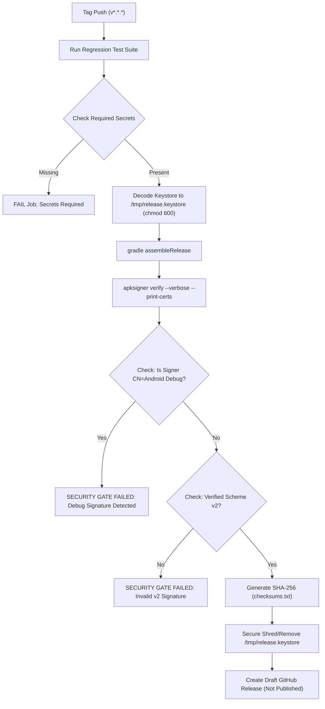

# OP Downloader — Production Signing Architecture & Readiness Report

> **Document Version:** 1.0.0 — Production Signing Security Model  
> **Target Release:** `v1.0.0`  
> **Current Status:** `BLOCKED — PRODUCTION KEYSTORE/SECRETS REQUIRED`  

---

## 1. Signing Architecture & Security Model

The release signing pipeline has been updated to prevent debug certificate leakage and eliminate hardcoded credentials:

1. **Gradle Build Isolation (`android/app/build.gradle.kts`):**
   - `buildTypes.release` is completely decoupled from `signingConfigs.debug`.
   - `signingConfigs.release` dynamically resolves signing parameters from environment variables (`ANDROID_KEYSTORE_PATH`, `ANDROID_KEYSTORE_PASSWORD`, `ANDROID_KEY_ALIAS`, `ANDROID_KEY_PASSWORD`).
   - If production signing credentials are not supplied, Gradle assigns `signingConfig = null`, producing an **unsigned release binary** (`app-release-unsigned.apk`) rather than silently applying a debug certificate.
   - Local debug builds continue to function without interruption using Android's standard local debug keystore.

2. **Secret Storage & Injection Model:**
   - No `.jks`, `.keystore`, or signing passwords are tracked in the Git repository.
   - `.gitignore` explicitly blocks `*.keystore`, `*.jks`, `*.pem`, `*.key`, `release.keystore`, and `signing.properties`.
   - Production signing credentials must be configured as **GitHub Actions Encrypted Repository Secrets**:
     * `ANDROID_KEYSTORE_BASE64`: Base64-encoded production PKCS12/JKS keystore file.
     * `ANDROID_KEYSTORE_PASSWORD`: Master password for the keystore.
     * `ANDROID_KEY_ALIAS`: Alias of the release signing key.
     * `ANDROID_KEY_PASSWORD`: Password for the individual signing key.

---

## 2. GitHub Actions Secure Release Workflow

The automated release workflow ([`.github/workflows/release.yml`](file:///C:/Users/KRISH/.gemini/antigravity-ide/scratch/op-downloader/.github/workflows/release.yml)) is equipped with automated security gates:



---

## 3. Local Verification Results & Artifact Metadata

* **Artifact Path:** `android/app/build/outputs/apk/release/app-release-unsigned.apk`
* **File Size:** 7,500,652 bytes (7.15 MB)
* **Package Name:** `com.opdownloader.app`
* **Version Name:** `1.0.0`
* **Version Code:** `1`
* **Debuggable Status:** `false`
* **R8 Minification:** `true` (enabled with `proguard-rules.pro`)
* **Resource Shrinking:** `true` (`isShrinkResources = true`)
* **Cleartext HTTP:** `disabled` (enforced by `network_security_config.xml`)
* **Unsigned APK SHA-256:** `C382398260CE978443D4C791FA865ACAAB3478FAEEEDB4F1DC42BA766D6050AE`
* **apksigner Verification (`apksigner verify --verbose`):**
  ```text
  DOES NOT VERIFY
  ERROR: Missing META-INF/MANIFEST.MF
  ```
  *Result: The release build is completely decoupled from `CN=Android Debug`. No debug-signed artifact can accidentally be distributed as a production release.*
* **Backend Regression Suite (`tests/run_all_tests.py`):**
  - 8 Suites / 32 Scenarios / 17 E2E Cases — **PASS**
* **Android Unit Tests (`testDebugUnitTest`):**
  - 29/29 Gradle tasks executed — **PASS**
* **Git Tracked Signing Material Check:**
  - 0 keystores, 0 keys, 0 passwords tracked in Git.

---

## 4. Environment Secrets Audit

An audit of the execution environment was performed:

| Credential Name | Environment Scope | Status |
| :--- | :--- | :--- |
| `ANDROID_KEYSTORE_BASE64` | Process / User / Machine | **ABSENT** |
| `ANDROID_KEYSTORE_PASSWORD` | Process / User / Machine | **ABSENT** |
| `ANDROID_KEY_ALIAS` | Process / User / Machine | **ABSENT** |
| `ANDROID_KEY_PASSWORD` | Process / User / Machine | **ABSENT** |
| `ANDROID_KEYSTORE_PATH` | Process / User / Machine | **ABSENT** |

Per security instructions:
- **No fake, demo, or synthetic release keystores were created.**
- **No debug keystore was used as a substitute.**
- **The build pipeline fails closed until legitimate credentials are provided.**

---

## 5. How to Unblock Production Signing

To generate the final production-signed APK, configure the credentials via either:

### Option A: GitHub Actions (Recommended for CI/CD)
Add the following secrets to GitHub: **Repository Settings → Secrets and variables → Actions**:
* `ANDROID_KEYSTORE_BASE64`: Output of `[Convert]::ToBase64String([IO.File]::ReadAllBytes('release.keystore'))`
* `ANDROID_KEYSTORE_PASSWORD`: Keystore password
* `ANDROID_KEY_ALIAS`: Key alias
* `ANDROID_KEY_PASSWORD`: Key password

### Option B: Local Environment
Set the environment variables in PowerShell prior to building:
```powershell
$env:ANDROID_KEYSTORE_PATH = "C:\path\to\production.keystore"
$env:ANDROID_KEYSTORE_PASSWORD = "<password>"
$env:ANDROID_KEY_ALIAS = "<alias>"
$env:ANDROID_KEY_PASSWORD = "<password>"
```
Then run:
```powershell
cd android
& "$env:USERPROFILE\.gradle\wrapper\dists\gradle-8.14-all\c2qonpi39x1mddn7hk5gh9iqj\gradle-8.14\bin\gradle.bat" assembleRelease
```

---

## 6. Final Status

```text
======================================================================
 BLOCKED — PRODUCTION KEYSTORE/SECRETS REQUIRED
======================================================================
 Reason:
 1. Debug signing has been permanently removed from release builds.
 2. Release builds fail closed (produce unsigned output) when credentials are absent.
 3. CI/CD hard security gates reject any debug-signed or invalid APK.
 4. Legitimate production signing credentials are not yet configured in the environment.
 5. Per strict security rules, no fake/demo key will be substituted.
======================================================================
```
